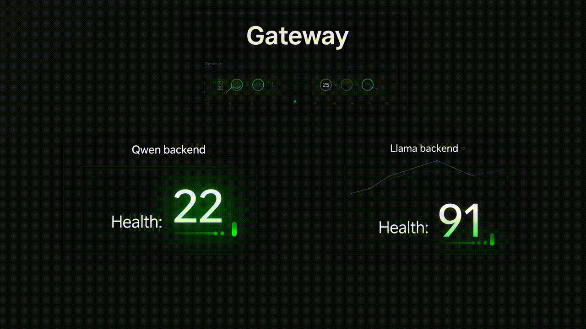
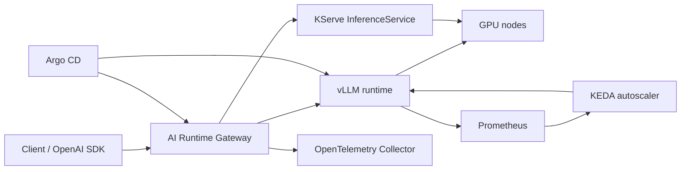
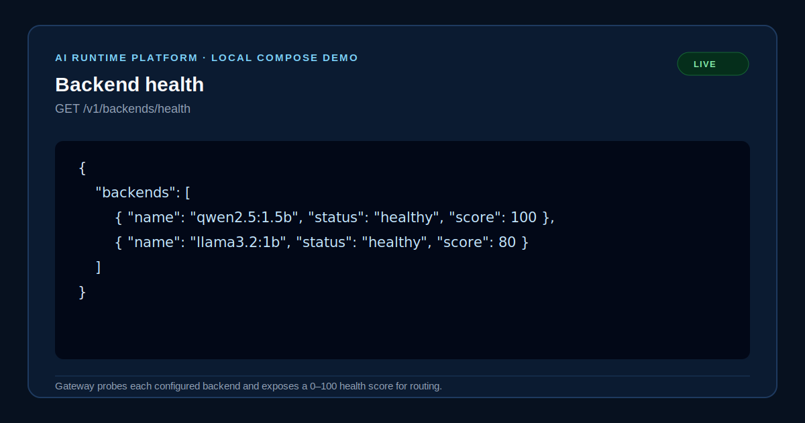
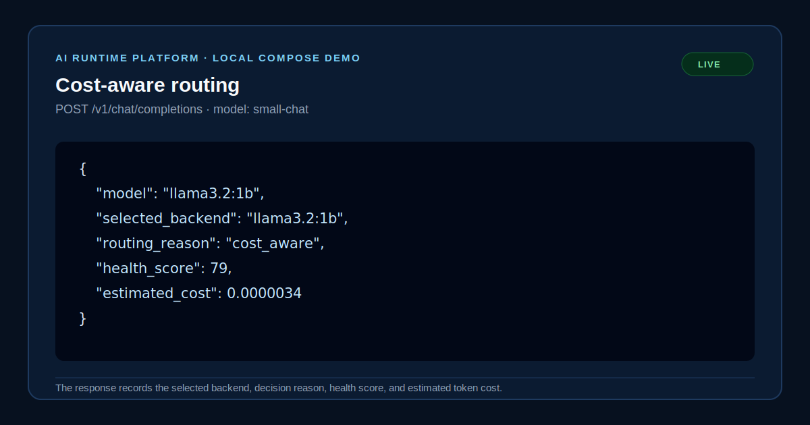
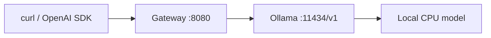

# AI Runtime Platform

> Service-mesh style runtime for private LLM inference with an OpenAI-compatible gateway, policy-based routing, vLLM, KServe, KEDA, OpenTelemetry and GitOps.

This repository demonstrates the runtime decision layer of an AI platform: receiving an OpenAI-compatible request, evaluating model health, latency, cost and route policy, selecting the best backend, and emitting operations-grade telemetry. It deliberately does not present a model governance control plane.

## Architecture at a glance

| Local demo | Production runtime | Router intelligence |
| --- | --- | --- |
| Ollama + Docker Compose + CPU | vLLM / KServe / GPU / KEDA / Argo CD | Canary / fallback / health / cost |

Start with the [30-second demo flow](docs/demo-flow.md), inspect the [full architecture](docs/architecture.md), or read the [runtime decision engine](docs/runtime-decision-engine.md). The decision loop combines route policy with health, latency, and configured cost to select a backend and makes that decision visible in every completion response.

## Why this is not another LLM proxy

Most simple LLM gateways forward a request to one configured backend. This project models the gateway as an LLM service mesh: the request path becomes a runtime decision point.

```text
Request
  -> health score
  -> latency score
  -> cost score
  -> route policy
  -> canary / fallback guardrails
  -> selected model backend
```

| Basic proxy | AI Runtime Platform |
| --- | --- |
| Static upstream | Policy-driven backend selection |
| One model target | Virtual model aliases and weighted routes |
| Failure after timeout | Health-aware preemptive rerouting |
| No cost context | Per-request estimated cost attribution |
| Hidden routing | `selected_backend`, `routing_reason`, `health_score`, `fallback_used` |

## Runtime Platform Demo

The gateway behaves like an inference runtime router, not a static proxy: every request is evaluated against route policy, backend health, latency, fallback protection, and configured model cost.


| Scenario | What it shows |
| --- | --- |
|  | Stable `X-Request-ID` based 90/10 canary routing between Qwen and Llama. |
|  | Automatic failover when the primary model backend is unavailable. |
|  | Preemptive routing away from a backend with a low health score. |
|  | Balanced runtime selection using health, latency, and configured token cost. |



## How the Projects Fit Together

This repository is part of a larger AI Platform portfolio. Read the [portfolio overview](docs/portfolio-overview.md) for the full architecture.

| Layer | Responsibility | Repository |
| --- | --- | --- |
| **AI Runtime Platform** | Executes private LLM inference through an OpenAI-compatible gateway, model routing, vLLM/Ollama, KServe, and KEDA. | [justrunme/ai-runtime-platform](https://github.com/justrunme/ai-runtime-platform) |
| **AI Infrastructure Control Plane** | Observes, governs, forecasts, and operates AI workloads through telemetry, policy, cost control, risk scoring, approvals, digital twin topology, and GitOps. | [justrunme/ai-infra-control-plane](https://github.com/justrunme/ai-infra-control-plane) |

The Runtime Platform executes AI workloads. The Control Plane uses their operational signals to observe, govern, predict, and control the platform.

## Local demo evidence

The following snapshots are captured from the CPU-only Ollama + gateway Compose profile. They show the operational signals the gateway exposes to a caller; they are not mocked UI panels.





## Demo flow: no GPU required

The local profile proves the public request path on a laptop without compromising the production design:



```sh
docker compose -f deploy/local/docker-compose.yaml up --build
```

The first launch downloads `qwen2.5:1.5b`, then serves it through the gateway's standard `/v1/chat/completions` endpoint. See the full [local demo guide](deploy/local/README.md), including the response check and model selection. This local profile validates routing and API compatibility only; GPU performance, KEDA, KServe and GitOps remain production-path components.

## What is implemented

- OpenAI-compatible `POST /v1/chat/completions` gateway with explicit model-to-backend routing.
- Gateway-generated request ID propagation, OpenTelemetry spans exported over OTLP (console fallback), and estimated cost from the returned token usage.
- Optional API-key authentication and a Prometheus `/metrics` endpoint exposing the gateway's own routing, fallback, latency, and cost signals.
- Production-oriented vLLM Helm chart: GPU requests/limits, GPU node selection, probes, a Prometheus metrics service, and optional `ServiceMonitor`.
- KServe `InferenceService` example in Standard mode for a generative workload.
- KEDA `ScaledObject` based on vLLM queue pressure (`vllm:num_requests_waiting`), rather than CPU utilization.
- OpenTelemetry Collector configuration, Argo Rollouts canary example, Argo CD application, and a k6 benchmark.
- GitHub Actions validation for Python, Helm, and Kustomize rendering.

## Scope and deployment modes

The Helm chart is the primary vLLM deployment path. The KServe and Argo Rollouts manifests are focused examples of alternative operating modes; they are not intended to be applied together to the same runtime. Likewise, the KEDA target must not be controlled by a second HPA.

| Component | Purpose | Requirement |
| --- | --- | --- |
| Gateway | OpenAI API, routing, trace and cost attribution | Kubernetes + an accessible model backend |
| vLLM chart | Primary GPU inference runtime | NVIDIA device plugin, model access credentials |
| KServe example | Kubernetes-native model lifecycle alternative | KServe >= 0.18 Standard mode |
| KEDA example | Queue-aware scaling | KEDA + Prometheus |
| Observability | traces and model metrics | OpenTelemetry Operator + Prometheus stack |
| GitOps | reconciliation | Argo CD |

## Quick start

Prerequisites: Kubernetes cluster with GPU nodes, NVIDIA device plugin, Helm, `kubectl`, an OCI registry for the gateway image, and model download credentials where the model requires them.

```sh
git clone https://github.com/justrunme/ai-runtime-platform.git
cd ai-runtime-platform

# Local source checks
python -m venv .venv
. .venv/bin/activate
pip install -e '.[dev]'
make validate

# Primary serving path. Review and pin values for the target cluster first.
kubectl apply -f deploy/base/namespace.yaml
helm upgrade --install qwen charts/vllm-runtime \
  --namespace ai-runtime \
  --set model.name=Qwen/Qwen2.5-7B-Instruct \
  --set model.servedName=qwen2.5-7b-instruct

# Build and publish the gateway image before applying deploy/base/gateway.yaml.
```

The chart defaults are intentionally only a starting profile. Production clusters must set the model revision, registry digest, GPU type/count, persistent model-cache strategy, network policy, authentication, and resource sizing through GitOps values.

## Gateway contract

The gateway accepts the standard OpenAI chat-completions shape and reads model targets from `MODEL_TARGETS`:

```json
{
  "qwen2.5-7b-instruct": {
    "url": "http://qwen-vllm-runtime.ai-runtime.svc.cluster.local:8000",
    "input_cost_per_million": 0.20,
    "output_cost_per_million": 0.20
  }
}
```

`runtime_cost.estimated` is an attribution estimate based on the returned `usage` block. It is not a cloud billing source of truth.

## Authentication

Authentication is off by default so the local demo stays frictionless. Set `GATEWAY_API_KEYS` to a comma-separated list of keys to require one on every `/v1/*` request; `/healthz` and `/metrics` stay open for probes and scraping. Callers present the key as `Authorization: Bearer <key>` or `X-API-Key: <key>`.

```sh
curl http://localhost:8080/v1/chat/completions \
  -H 'authorization: Bearer my-key' \
  -H 'content-type: application/json' \
  -d '{"model":"qwen2.5:1.5b","messages":[{"role":"user","content":"Hello"}]}'
```

In the Kubernetes path the value is read from the optional `ai-runtime-gateway-auth` Secret (`api-keys` field). This is a single shared-key layer; per-tenant keys, quotas, and JWT/OIDC remain a mesh/gateway concern on the roadmap.

## Metrics

The gateway exposes its own Prometheus metrics at `GET /metrics`, independent of the upstream vLLM metrics:

| Metric | Type | Labels |
| --- | --- | --- |
| `gateway_chat_requests_total` | counter | `requested_model`, `selected_backend`, `routing_reason`, `outcome` |
| `gateway_chat_fallback_total` | counter | `selected_backend`, `routing_reason` |
| `gateway_chat_duration_seconds` | histogram | `routing_reason` |
| `gateway_chat_estimated_cost_usd_total` | counter | `selected_backend` |

The base deployment carries `prometheus.io/scrape` pod annotations, and `deploy/observability/gateway-servicemonitor.yaml` provides a Prometheus Operator `ServiceMonitor`. Traces are exported over OTLP when `OTEL_EXPORTER_OTLP_ENDPOINT` is set and fall back to a console exporter locally.

## Canary model rollout

The gateway supports a virtual model alias that resolves to weighted backends. This lets clients retain one model identifier while a new model receives a controlled fraction of traffic.

```json
{
  "small-chat-canary": {
    "targets": [
      {"model": "qwen2.5:1.5b", "weight": 90},
      {"model": "llama3.2:1b", "weight": 10}
    ]
  }
}
```

Set that JSON in `MODEL_ROUTES`, with every referenced model declared in `MODEL_TARGETS` (or supplied by `OLLAMA_MODELS` locally). The gateway hashes `X-Request-ID` with the route name, so retries with the same ID remain on the same backend. It forwards the selected model name upstream and records both requested and selected models in tracing.

```sh
curl http://localhost:8080/v1/routes

curl http://localhost:8080/v1/chat/completions \
  -H 'content-type: application/json' \
  -H 'x-request-id: canary-demo-001' \
  -d '{"model":"small-chat-canary","messages":[{"role":"user","content":"Hello"}]}'
```

Route percentages control request allocation, not quality or safety. Promote a canary only after evaluating comparable latency, error, token-throughput, cost, and task-quality signals.

## Model fallback routing

A failover route has an ordered primary and fallback, rather than a weighted split:

```json
{
  "small-chat": {
    "primary": "qwen2.5:1.5b",
    "fallback": "llama3.2:1b"
  }
}
```

For non-streaming completions, the gateway retries the fallback once when the primary times out, encounters a network error, or returns a `5xx`. It does not mask client-side `4xx` errors. The response has top-level `selected_backend` and `fallback_used` fields; streaming responses convey the same information through `X-Selected-Backend` and `X-Fallback-Used` headers.

Both request paths feed the health store: a failed primary and the served backend are recorded for streaming and non-streaming completions, so `error_rate` and `fallback_rate` reflect all traffic. Streaming failover is limited to the response headers stage; once upstream bytes start flowing, a mid-stream error cannot be transparently re-routed.

## Backend health scoring

Each gateway replica probes every configured backend on `BACKEND_HEALTH_INTERVAL_SECONDS` (15 seconds by default). It combines probe availability and latency with request-path error and fallback rates into a `0–100` score:

```sh
curl http://localhost:8080/v1/backends/health
```

```json
{
  "backends": [
    {
      "name": "qwen-local",
      "model": "qwen2.5:1.5b",
      "status": "healthy",
      "score": 96,
      "latency_ms": 420,
      "error_rate": 0.01,
      "fallback_rate": 0.0
    }
  ]
}
```

The current store is in-memory per gateway replica, which is deliberate for the MVP. The gateway now exports request, fallback, latency, and cost signals through `/metrics`, but each replica still scores and routes from its own local view. A horizontally scaled production gateway should drive routing from the shared Prometheus aggregate before treating these decisions as fleet-wide.

## Health-aware routing

Failover routes can prevent an avoidable failure by setting a minimum backend score:

```json
{
  "small-chat": {
    "primary": "qwen2.5:1.5b",
    "fallback": "llama3.2:1b",
    "min_health_score": 50,
    "unhealthy_action": "skip"
  }
}
```

With this policy, a healthy primary remains selected. If its score falls below 50, the gateway selects the healthy fallback before sending inference traffic. If neither backend meets the threshold, it returns `503`. A preemptive reroute returns `fallback_used: true` and `routing_reason: "health_score"`.

## Cost-aware routing

When both failover backends are healthy, a balanced policy ranks them by health, observed latency, and configured unit token cost:

```json
{
  "routing_policy": {
    "strategy": "balanced",
    "weights": {"health": 0.5, "latency": 0.3, "cost": 0.2}
  }
}
```

The gateway picks the highest weighted score and returns `routing_reason: "cost_aware"`, `selected_backend`, `health_score`, and `estimated_cost`. This is an in-memory, per-replica decision for the MVP; use shared Prometheus/telemetry signals before treating the policy as globally consistent at scale.

## Benchmark

Run a controlled benchmark against the gateway. Keep the model, GPU class, concurrency, context length, prompt mix, cache state, and sampling parameters in the benchmark record; otherwise latency comparisons are not defensible.

```sh
k6 run -e GATEWAY_URL=https://ai.example.com -e MODEL=qwen2.5-7b-instruct \
  loadtest/chat-completions.js
```

Track TTFT, inter-token latency, E2E latency, prompt/output tokens per second, queue depth, KV-cache usage, error rate, and cost estimate per successful request.

## Repository layout

```text
app/gateway/          FastAPI OpenAI-compatible gateway
charts/vllm-runtime/  Primary vLLM Helm chart
deploy/               Kustomize base and optional platform integrations
deploy/local/         CPU-only Ollama + gateway Compose demo
gitops/argocd/        Argo CD application
loadtest/             k6 inference benchmark
docs/                 Architecture and operational decisions
```

## Upstream references

- [vLLM production stack](https://docs.vllm.ai/deployment/integrations/production-stack.html) documents Helm-based deployment, model-aware routing, and observability.
- [vLLM production metrics](https://docs.vllm.ai/en/latest/usage/metrics/) exposes the Prometheus metrics used by the scaling and dashboard design.
- [KServe](https://kserve.github.io/kserve/) provides the Kubernetes-native generative/predictive inference surface; its [Standard deployment mode](https://kserve.github.io/website/docs/admin-guide/kubernetes-deployment) supports optional KEDA custom-metric autoscaling.
- [KEDA's Prometheus scaler](https://keda.sh/docs/2.8/scalers/prometheus/) requires a query that evaluates to one scalar/vector element.

## Roadmap

1. Extend the shared-key auth into Envoy AI Gateway policies, per-tenant API keys, rate limits, and JWT/OIDC authentication.
2. Add Ray Serve LLM as a multi-model/pipeline deployment profile.
3. Build a Grafana dashboard and SLO recording rules on the exported gateway metrics for TTFT, TPOT, queue depth, and error budget.
4. Add canary analysis gates and rollback based on live latency/error signals.
5. Add a reproducible benchmark report for a named GPU/model/version profile.

## Security note

No production secret, token, model licence acceptance, or cloud credential belongs in this repository. Supply them through the cluster's secret-management and workload-identity mechanism.
