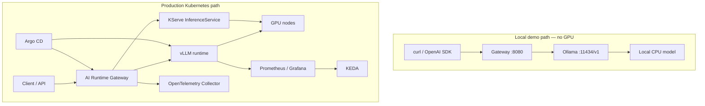
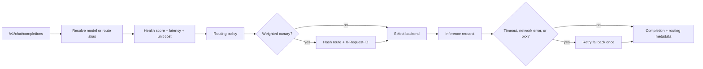
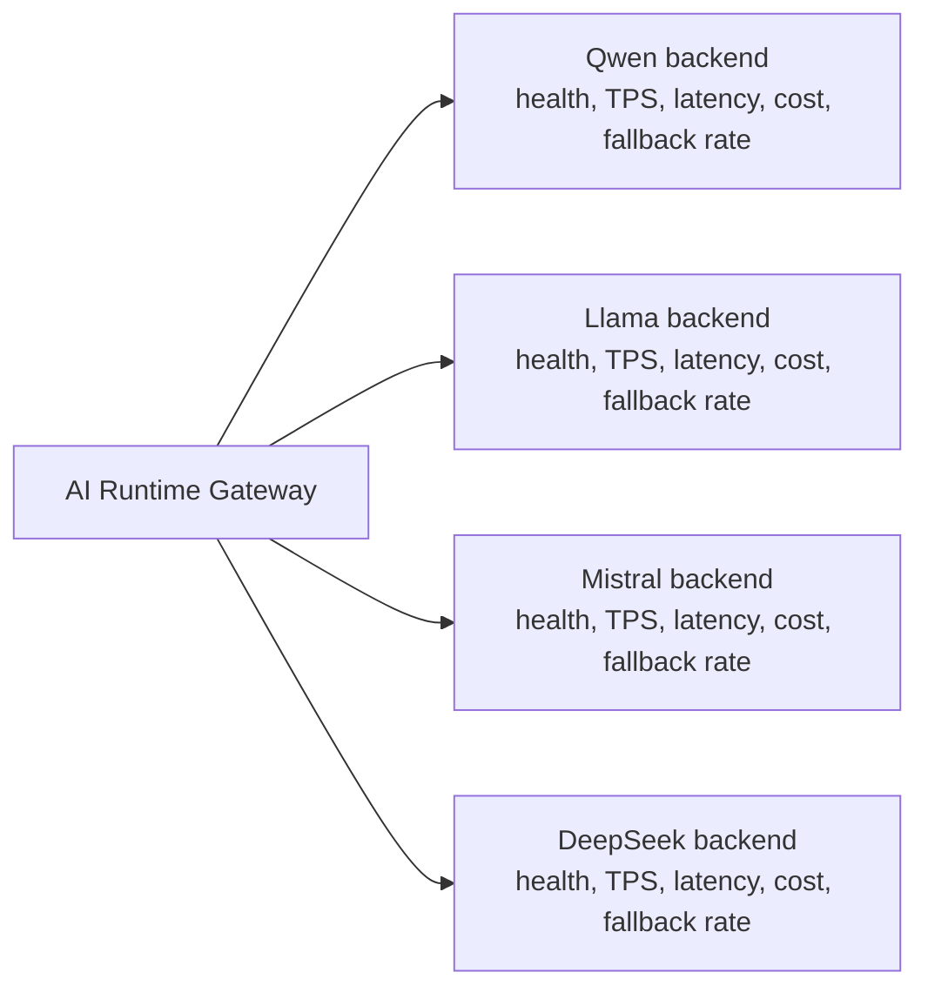
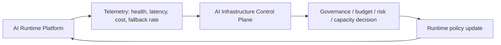

# AI Runtime Platform architecture

## In one sentence

AI Runtime Platform is a service-mesh style inference runtime that exposes an OpenAI-compatible gateway, runs private LLM backends, and makes explicit routing decisions from live operational signals.

## Two operating paths

The local path validates the same public gateway contract and routing behaviour without a GPU cluster. The production path introduces GPU scheduling, model lifecycle, observability, autoscaling, and GitOps reconciliation.

## Gateway decision loop

The router supports two route types:

| Route type | Decision | Purpose |
| --- | --- | --- |
| Weighted | Deterministic request affinity across weighted targets | Canary model rollout |
| Failover | Primary/fallback pair with optional health and cost policy | Resilience and efficient backend selection |

## Routing signals and outcomes

| Signal | Source | Router behaviour |
| --- | --- | --- |
| Request ID | Gateway header | Keeps a canary retry on the same target |
| Availability and latency | Periodic backend probes | Excludes unhealthy candidates |
| Error and fallback rate | Gateway request outcomes | Reduces backend health score |
| Unit token cost | Target configuration | Participates in balanced routing |
| Route policy | `MODEL_ROUTES` | Defines traffic split, threshold, and strategy |

For a balanced policy, the default weights are health 0.5, latency 0.3, and cost 0.2. The response makes the outcome inspectable through `selected_backend`, `routing_reason`, `health_score`, `estimated_cost`, and `fallback_used`.

## Runtime topology

In production, model backends should be treated as operational nodes, not static upstream URLs:

This topology is what makes the gateway closer to an LLM service mesh than a simple proxy. Backends are selected from their current runtime characteristics and configured policy, not only from static model names.

## Policy loop with the control plane

The runtime executes requests. A control plane can observe the runtime, evaluate governance or budget constraints, and publish updated routing policy:

The current gateway reads policy from configuration. The next platform step is a dynamic policy engine that can update strategy, weights, thresholds, and backend eligibility without changing the client contract. See [Runtime Decision Engine](runtime-decision-engine.md).

## Operational boundaries

- The health store is in-memory per gateway replica by default, which suits the demo and a single replica. Set `REDIS_URL` to share health and request signals across replicas through Redis so routing decisions are fleet-wide and consistent.
- Cost is request attribution from token usage and configured unit rates. It is not cloud billing.
- Canary traffic allocation is not canary analysis. Promotion still needs comparable SLO and quality evidence.
- KServe, vLLM, KEDA, and Argo CD manifests are production profiles. They are not applied by the local Docker demo.
