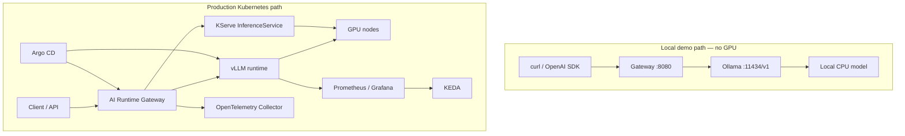
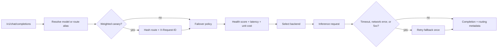

# AI Runtime Platform architecture

## In one sentence

AI Runtime Platform is a Kubernetes-native inference runtime that exposes an OpenAI-compatible gateway, runs private LLM backends, and makes explicit routing decisions from live operational signals.

## Two operating paths

The local path validates the same public gateway contract and routing behaviour without a GPU cluster. The production path introduces GPU scheduling, model lifecycle, observability, autoscaling, and GitOps reconciliation.

## Gateway decision loop

The router supports two route types:

| Route type | Decision | Purpose |
| --- | --- | --- |
| Weighted | Deterministic request affinity across weighted targets | Canary model rollout |
| Failover | Primary/fallback pair with optional health and cost policy | Resilience and efficient backend selection |

## Routing signals and outcomes

| Signal | Source | Router behaviour |
| --- | --- | --- |
| Request ID | Gateway header | Keeps a canary retry on the same target |
| Availability and latency | Periodic backend probes | Excludes unhealthy candidates |
| Error and fallback rate | Gateway request outcomes | Reduces backend health score |
| Unit token cost | Target configuration | Participates in balanced routing |
| Route policy | `MODEL_ROUTES` | Defines traffic split, threshold, and strategy |

For a balanced policy, the default weights are health 0.5, latency 0.3, and cost 0.2. The response makes the outcome inspectable through `selected_backend`, `routing_reason`, `health_score`, `estimated_cost`, and `fallback_used`.

## Operational boundaries

- The health store is intentionally in-memory per gateway replica. It is suitable for the demo and a single replica; fleet-wide decisions require shared metrics or telemetry aggregation.
- Cost is request attribution from token usage and configured unit rates. It is not cloud billing.
- Canary traffic allocation is not canary analysis. Promotion still needs comparable SLO and quality evidence.
- KServe, vLLM, KEDA, and Argo CD manifests are production profiles. They are not applied by the local Docker demo.
