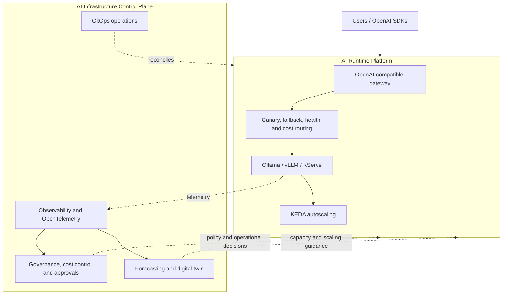
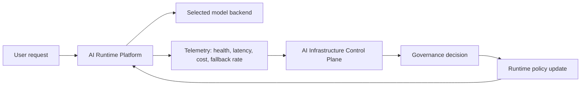

# AI Platform Portfolio Overview

This repository and [AI Infrastructure Control Plane](https://github.com/justrunme/ai-infra-control-plane) demonstrate two complementary layers of a private AI platform. They are intentionally separate repositories so the runtime concerns and the operating model remain independently understandable and deployable.

## Responsibilities

### AI Runtime Platform

The runtime layer executes AI workloads:

- OpenAI-compatible API gateway
- Runtime decision engine for model routing
- Canary deployments
- Fallback, health-aware, and cost-aware routing
- Ollama and vLLM integration
- KServe inference workloads
- KEDA autoscaling

Repository: [justrunme/ai-runtime-platform](https://github.com/justrunme/ai-runtime-platform)

### AI Infrastructure Control Plane

The management layer operates AI workloads:

- AI observability and OpenTelemetry telemetry
- Grafana and Loki
- Cost governance and risk scoring
- Approval workflows
- Forecasting and digital twin topology
- GitOps operations

Repository: [justrunme/ai-infra-control-plane](https://github.com/justrunme/ai-infra-control-plane)

## Architecture

The Runtime Platform executes AI workloads. The Control Plane observes, governs, predicts, and controls those workloads. Together they demonstrate a complete AI Platform architecture rather than a standalone gateway or an isolated governance service.

## Runtime and control-plane feedback loop

The two repositories become more valuable when they are read as one platform:

The runtime makes fast request-time decisions. The control plane evaluates slower operational concerns: governance, budget, risk, forecasting, and approval workflows. A dynamic policy engine would connect those layers by letting the control plane update route weights, thresholds, strategy, and backend eligibility while clients continue using the same OpenAI-compatible API.
