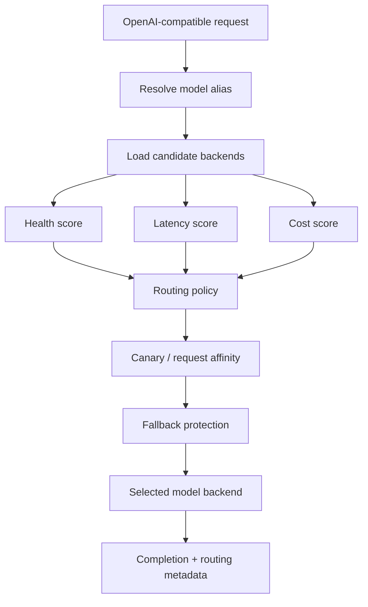
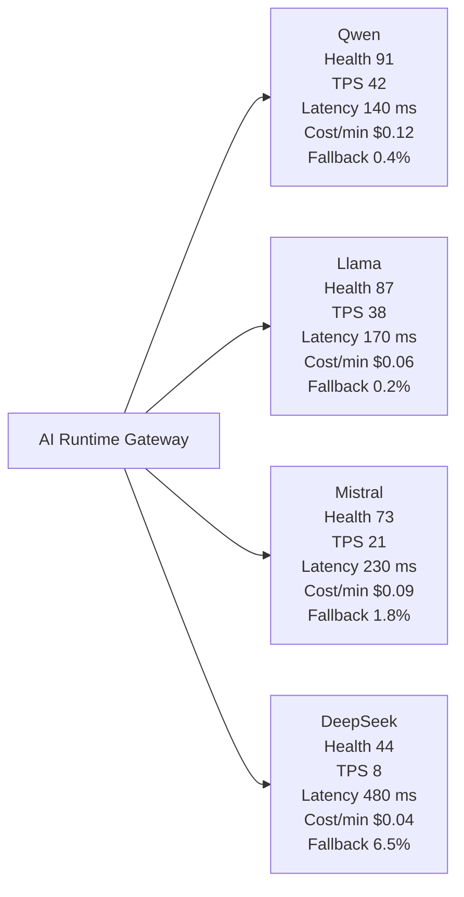
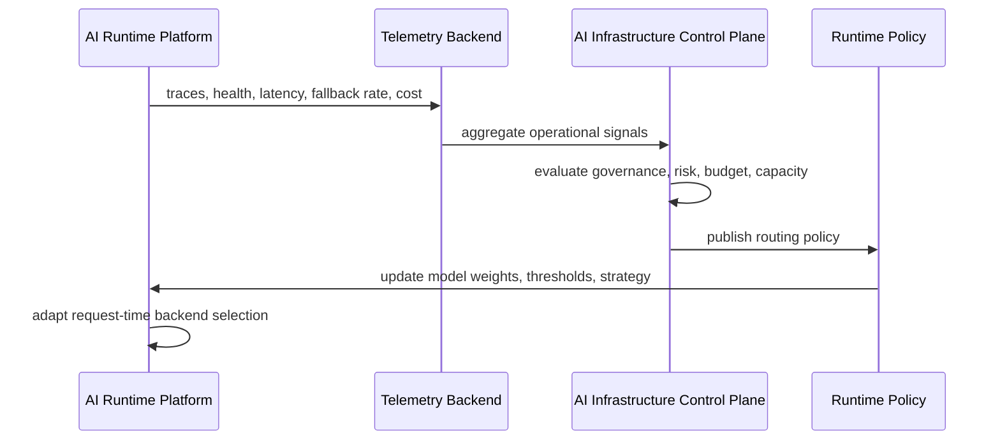

# Runtime Decision Engine

The gateway is the runtime decision engine for private LLM traffic. It does not only proxy OpenAI-compatible requests; it evaluates operational signals and route policy before selecting a model backend.

## Request-time decision model



The important design choice is separation of the client contract from backend selection. Clients call one model alias, while the runtime decides which backend should execute the request.

## Example scoring context

| Backend | Health | Latency | Unit cost | Runtime interpretation |
| --- | ---: | ---: | ---: | --- |
| Qwen | 91 | 140 ms | `$0.000008` | Healthy and fast, but more expensive |
| Llama | 87 | 170 ms | `$0.000004` | Healthy enough and cheaper |

With a balanced policy:

```json
{
  "routing_policy": {
    "strategy": "balanced",
    "weights": {
      "health": 0.5,
      "latency": 0.3,
      "cost": 0.2
    }
  }
}
```

The gateway can select Llama and return:

```json
{
  "selected_backend": "llama-local",
  "routing_reason": "cost_aware",
  "health_score": 87,
  "fallback_used": false,
  "runtime_cost": {
    "estimated": 0.000004
  }
}
```

This turns routing from an implementation detail into an inspectable runtime decision.

## Runtime topology map

The runtime can be understood as a topology of model backends behind one OpenAI-compatible gateway:



This topology is the runtime equivalent of a service mesh view: model backends are not just endpoints, they are operational nodes with health, throughput, latency, cost, and failure characteristics.

## Control Plane to Runtime policy loop

The project intentionally keeps runtime execution separate from governance. The current runtime already calls the Control Plane for request enforcement, MCP tool governance, intent resolution, and optional post-response evaluation. Longer term, the same boundary can also carry signed routing-policy updates.



Example policy update:

```yaml
routing:
  strategy: cost_aware
  min_health_score: 70
models:
  qwen:
    weight: 20
  llama:
    weight: 80
```

The runtime remains responsible for fast request execution. The control plane becomes responsible for policy, governance, forecasting, approvals, and operational decisions.

## Current implementation vs direction

| Capability | Current state | Direction |
| --- | --- | --- |
| OpenAI-compatible gateway | Implemented | Keep stable client contract |
| Canary routing | Implemented through weighted aliases | Add promotion signals from telemetry |
| Fallback routing | Implemented for timeout, network error, and `5xx` | Add richer failure classes |
| Health scoring | Implemented per gateway replica, Redis-backed when `REDIS_URL` is set | Export fleet-wide health to shared telemetry |
| Health-aware routing | Implemented with minimum score threshold | Use control-plane policy updates |
| Cost-aware routing | Implemented with configured unit costs | Connect budget policy from control plane |
| Governance enforcement | Implemented through `CONTROL_PLANE_URL` | Expand policy context and approval integration |
| MCP tool governance | Implemented through `/mcp/tools/{tool}/call` | Replace governed stubs with real upstream MCP servers |
| Intent resolution | Implemented through `/v1/intent/resolve` proxy | Add richer plan execution and audit correlation |
| OIDC/JWKS identity | Implemented for JWT verification and forwarding | Add production IdP examples beyond demo Keycloak |
| Tenant attribution | Implemented with in-memory or Redis-backed counters | Add persistent billing/chargeback integration |
| Dynamic policy engine | Not implemented | Watch signed policy config and apply without redeploying clients |

The next meaningful platform step is not another manifest. It is a dynamic policy engine that lets the control plane update routing strategy while the runtime keeps serving the OpenAI-compatible request path.
